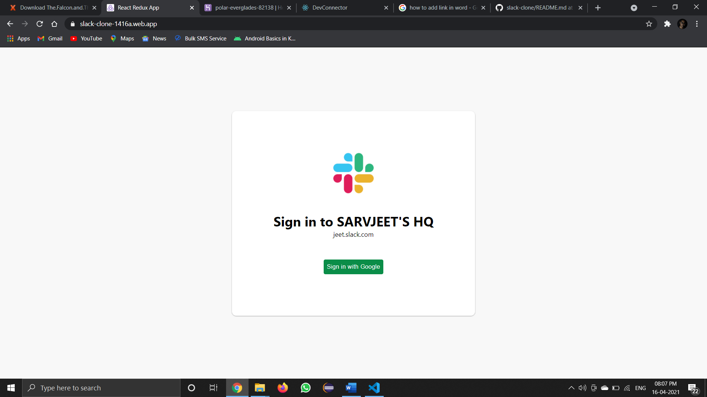
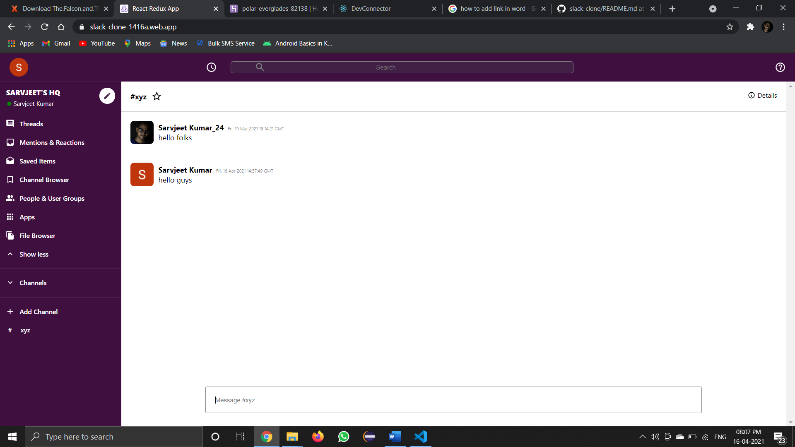

# Realtime Chat App(slack clone) ‎‍💻

-   A realtime chat app, built using React and Firebase
-   Functionalities of the app:
    -   Google login
    -   Create channels for chat
    -   Realtime chat experience

---

## Screenshots:

| Screen Name    | Screenshots                                                     |
| -------------- | --------------------------------------------------------------- |
| Landing Page   |  |
| Chat Interface |  |

---

## Run app on your local machine:

-   Clone the repository
    ```bash
    git clone https://github.com/SarvjeetGit/slack-clone.git
    ```
-   Open the project in your favorite editor
    ```bash
    cd slack-clone/
    ```
-   Install the dependencies
    ```bash
    npm i
    ```
-   Run the project in your local machine
    ```bash
    npm start
    ```

Do fork and star ⭐ the repo if you find it appreciable. For any queries and suggestions, Conatct me at my mailing address.
